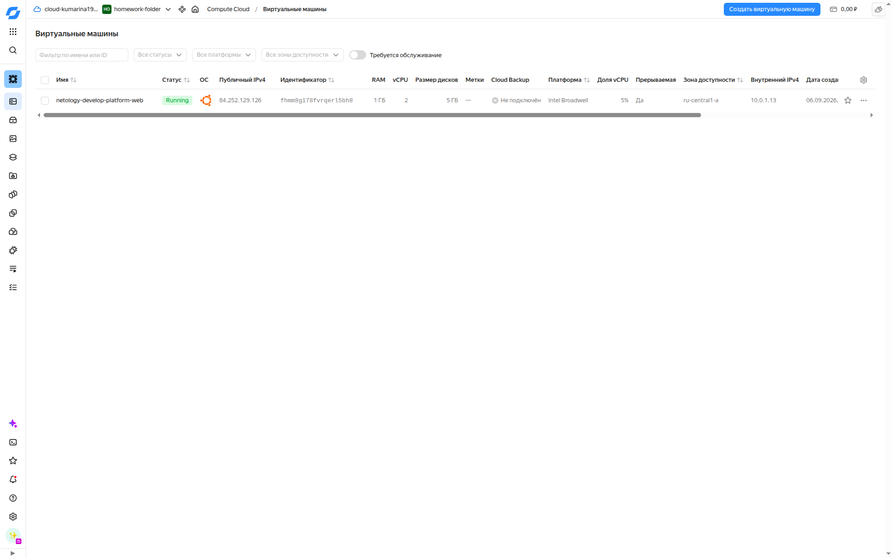
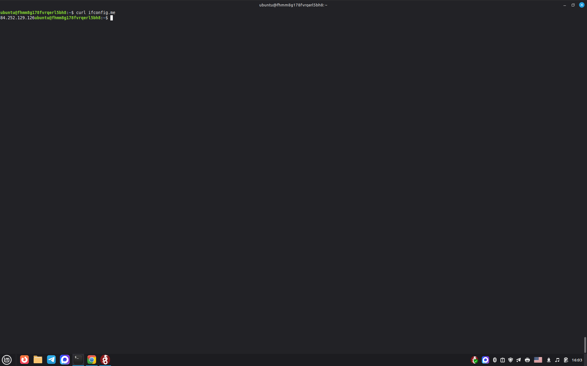
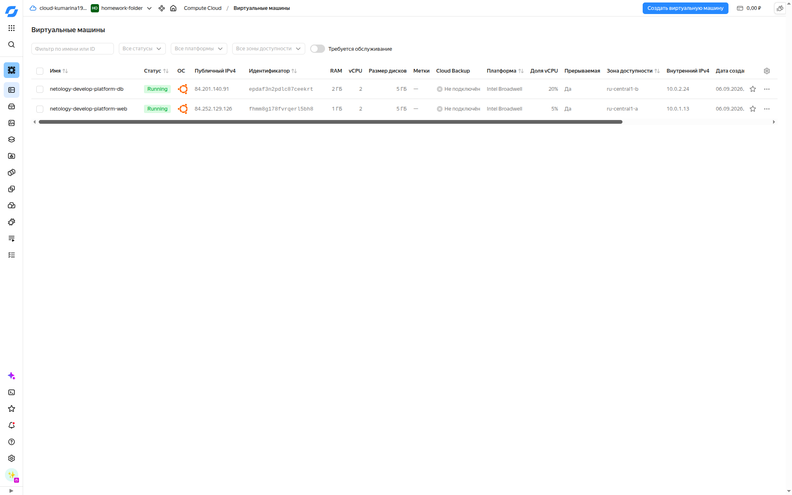
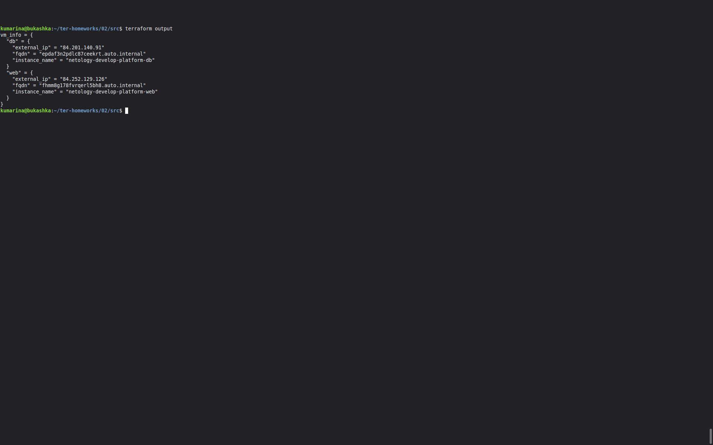
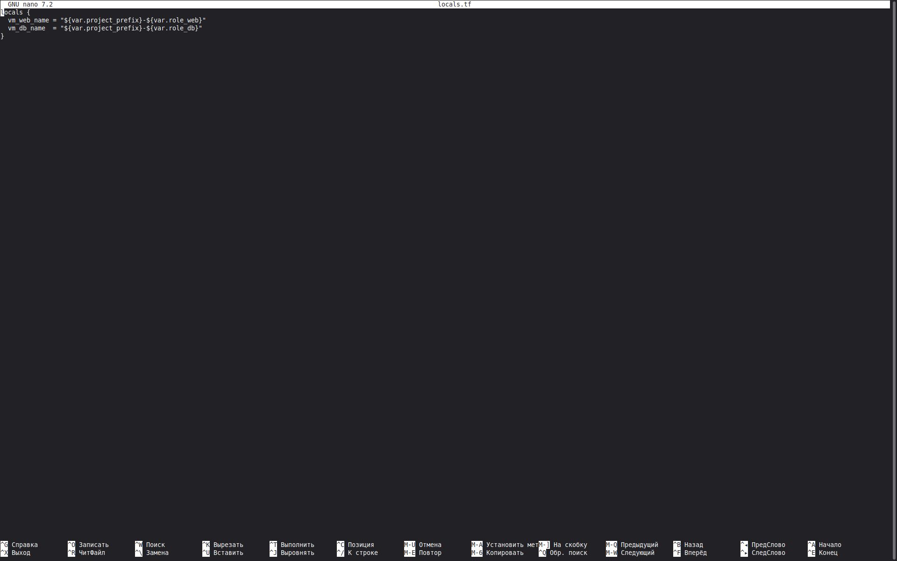
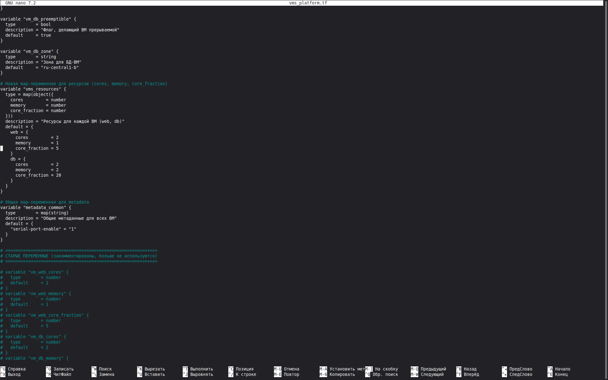
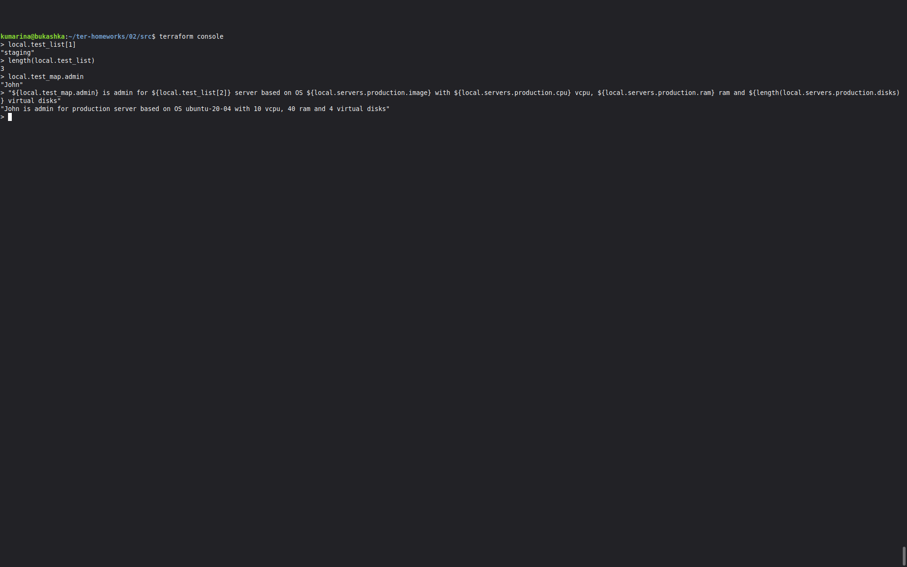
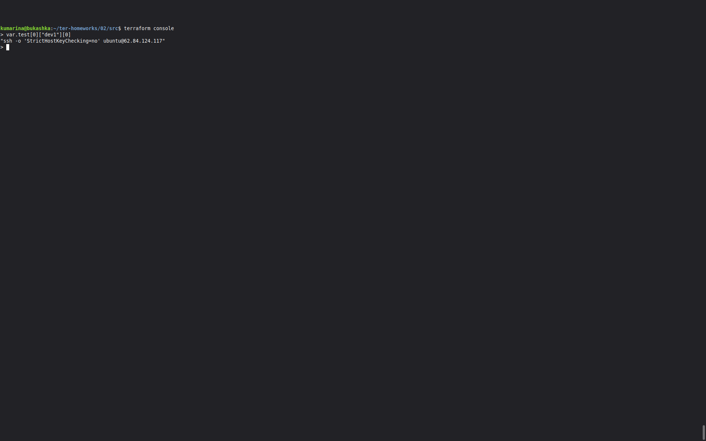

# Terraform-Basics-Yandex-Cloud-
Terraform Basics: Yandex Cloud 
### Задание 1

#### Ответы на вопросы:

1. Суть  синтаксической ошибки заключается в опечатке в значении параметра platform_id: вместо корректного идентификатора standard-v4 указано несуществующее значение standart-v4. Из-за лишней буквы t Terraform не может распознать указанную платформу.
Также после исправления опечатки standart-v4 → standard-v4 конфигурация всё равно не создаётся в актуальном Yandex Cloud, поскольку задано cores = 1. В современных конфигурациях Compute Cloud минимальное количество vCPU — 2. Для запуска ВМ пришлось изменить cores с 1 на 2. Это связано с изменением актуальных требований Yandex Cloud, а не с синтаксической ошибкой исходного задания.
2. preemptible = true позволяет использовать более дешёвые прерываемые ВМ, что удобно для учебных и тестовых стендов, которые не жалко остановить.
core_fraction = 5 позволяет снизить гарантированную производительность CPU до 5%, что уменьшает стоимость ВМ и подходит для нетребовательных учебных задач.

#### Скриншот ЛК Yandex Cloud с созданной ВМ, где видно внешний ip-адрес;


#### Cкриншот консоли, curl должен отобразить тот же внешний ip-адрес;


### Задание 2

#### Созданные переменные 

```hcl
# Переменные для первой ВМ (web)
variable "vm_web_image_family" {
  type        = string
  description = "Семейство образа для веб-ВМ"
  default     = "ubuntu-2004-lts"
}

variable "vm_web_name" {
  type        = string
  description = "Имя веб-ВМ"
  default     = "netology-develop-platform-web"
}

variable "vm_web_platform_id" {
  type        = string
  description = "Идентификатор платформы для веб-ВМ"
  default     = "standard-v1"
}

variable "vm_web_cores" {
  type        = number
  description = "Количество ядер CPU для веб-ВМ"
  default     = 2
}

variable "vm_web_memory" {
  type        = number
  description = "Объем памяти в ГБ для веб-ВМ"
  default     = 1
}

variable "vm_web_core_fraction" {
  type        = number

  description = "Уровень производительности vCPU для веб-ВМ"
  default     = 5
}

variable "vm_web_preemptible" {
  type        = bool
  description = "Флаг, делающий ВМ прерываемой"
  default     = true
}
```
### Задание 3

#### Создана 2 ВМ


### Задание 4

####  Вывод значений ip-адресов команды terraform output



### Задание 5




### Задание 6

В рамках задания я создала map-переменную vms_resources для ресурсов ВМ, общую metadata_common, закомментировала старые переменные.



### Задание 7

#### Команды и их вывод.



### Задание 8


